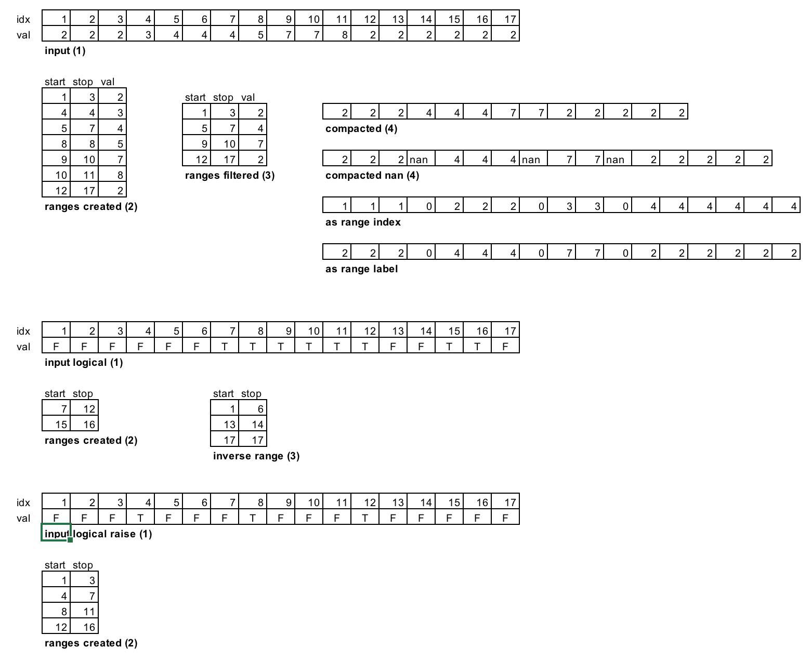

# matranges #

MATLAB toolbox for manipulating ranges of values in an array. Internally ranges are represented with start and end element, and if applicable, with an associated labels. For large array this approach is faster than using logicals. Ranges can be created from a label array, a logical array, or events.

Two implementations are provided: package (deprecated) and class (suggested)

Ranges can be manipulated in several ways, filtering them, enlarging, merging, and then converting the ranges back to the full array. 

Two operations are specifically useful: 

1) compact data: given an array X crates an array Y containing only the values references by the ranges

2) compact with nan injection: given an array X creates an array Y separating each range of values with a NaN. This is useful for plot or line

# Details #

Which are the representation or sources of ranges?

- [start,end] sequence of indices, eventually enforcing to be not overlapping and/or monotonic in start. 
	- in the case ranges are not overlapping, consecutive and monotonic only start is necessary
- logical marker of start or end, for consecutive ranges like 0 1 0 0 0 0 1 0 0 0 1 
- event logical: 1 1 1 1 1 0 0 0 0 1 1 1 1 1
- marker of group 1 1 1 1 1 2 2 2 2 2 3 3 3 3 3

The (start,end) sequence is the most efficient for subset selection, but for reconstructing the other two it requires the full length of the original data.

Also end can be inside [a,b] or outside the range [a,b). Just a matter of convention. The event logical format is very useful for performing combination of separate range sets.

# Operations #

- conversion among formats, the natural one is [start,end]
	end2ranges
	start2ranges
	event2ranges
	ranges2event	
- enlarge range by given amount
	enlargeranages(ra,amount)
- merge ranges that are distant less than given value
	mergeranges(ra,threshold)
- velocity estimator based on range margin
	[V,A] = rangesderive(data,range)
		It computes velocity and estimation using ranges as boundaries for vel/acc estimator
- merge of two range sets
	mergeranges(ra1,ra2)
- apply function
	rangefun(fun,ra1)
		applies range to function calling fun(start,end) 
- compact

# Example #

We start from labels and build range, then we take a matrix q and we build both the compact version and the version with nan

	r = ranges.fromlabels([1,2,3,3,3,4,4,4,5]);

	q = [1:9;2*(1:9)]';
	Y1c  = r.compact(q);
	Y1n = r.compactwithnan(q);

	r = r.filterlength(3,10);
	Y2c = r.compact(q);   
	Y2n = r.compactwithnan(q);  
